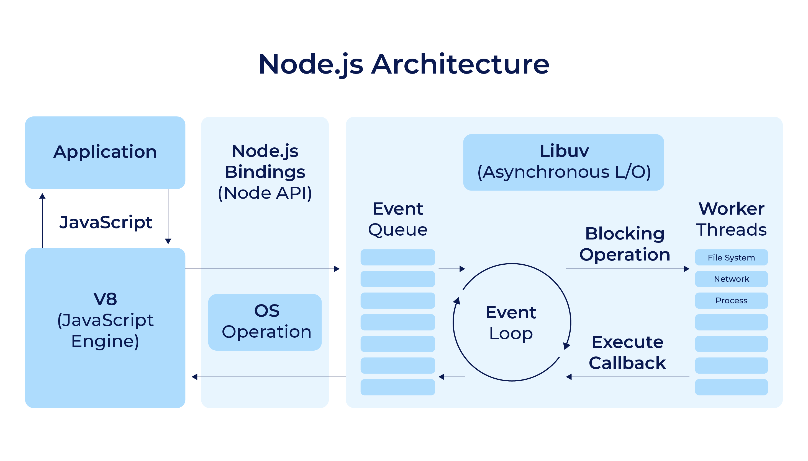
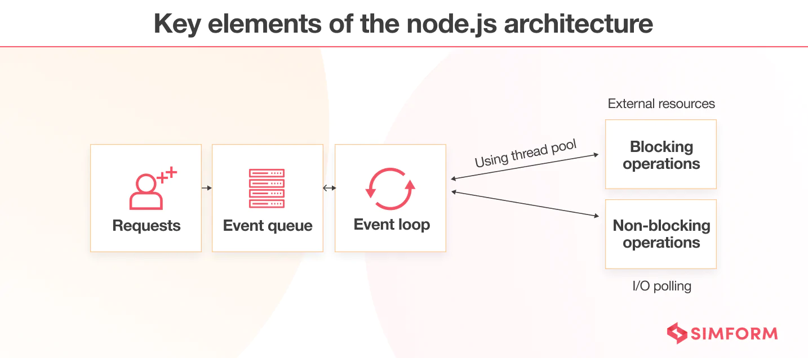
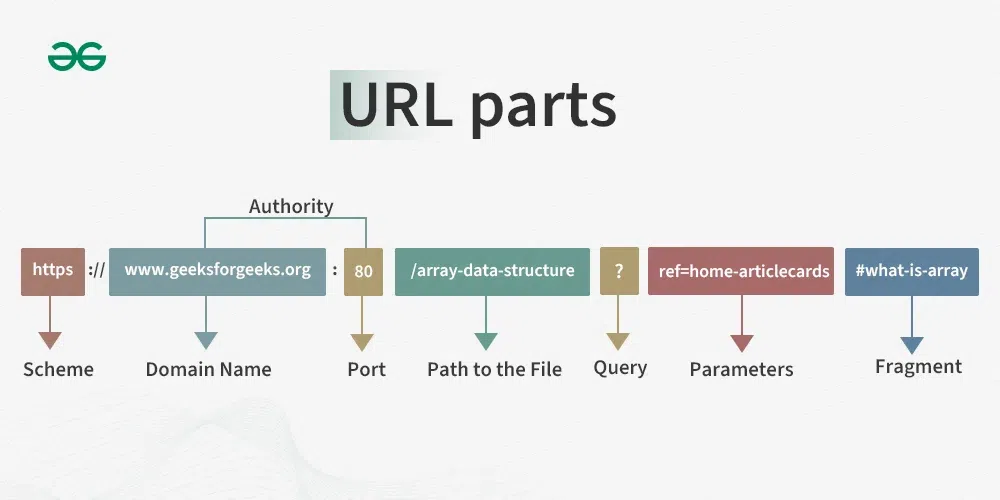

# Node JS

## What is Node JS:

Node JS is runtime Environment for JavaScript.

Node.js is an open-source, cross-platform JavaScript runtime environment that executes JavaScript code outside a web browser. Built on Chrome's V8 engine, it enables server-side development with JavaScript.

## Installation:

- Go to the Node.js
- Download Node.js from the [official website](https://nodejs.org/).
  - Download the Windows installer (LTS version recommended).
- Run the installer and follow the on-screen instructions.
- After installation, open the Terminal and verify the installation by running

```bash
node -v
npm -v 
```
📌 NPM mean Node package Manager 

## Helo World
- window
- npm package
- create script | start 

## Modules
- require |  import 
- exports 
- module.exports

## File System
- Create File (writeFileSyn | writeFile)
- Read File  (readFileSyn | readFile)
- Save previous data with out over write (append)
- copy File
- Delete File (unlinksync)
- Create Folder

## Architecture | How NodeJS Works?


- Default Thread pool size is 4
  - Max? = 8core cp = 8

```bash
const os = require('os');
console.log(os.cpus().length);
```
## Building HTTP Server

 <!-- in server Folder perform this task -->

- Creating an HTTP web server using NodeJS
- Creating HTTP server using NodeJS.
- Handling requests and sending responses in NodeJS
- Setting up a callback function for starting the server
- Headers provide extra information about the request.
- Building HTTP Server in NodeJS
- Creating a log for web server requests
- Creating multiple pages using switch case on request URL.
- Always support non-blocking requests for better performance

```js
const myServer = http.createServer((req, res) => {  
    res.end('Hello, Node.js Server!')
});

// run on port
myServer.listen(8000, () => {
    console.log('Server running at http://localhost:8000/');   
});

```
## Handling URL's in NodeJS


## HTTP Methods

- **GET** 
    - Purpose: Retrieve data from the server without modifying it.
    - Use Case: Fetching a webpage or retrieving data from an API.
- **POST**
  - Purpose: Send data to the server to create or update a resource.
  - Use Case: Submitting a form or uploading a file.
- **PUT**
  - Purpose: Update or create a resource at a specified URL.
  - Use Case: Replacing the data of an existing resource or creating a new resource.
- **PATCH**
  - Purpose: Partially update a resource.
  - Use Case: Updating a specific field of a resource.
- **DELETE**
  - Purpose: Remove a resource from the server.
  - Use Case: Deleting a user or post.


# Express JS

Express.js is a minimalist web application framework for Node.js. It is designed to simplify the process of building robust and scalable server-side applications. It allows developers to create web applications, RESTful APIs, and more, efficiently and with less boilerplate code.

### How to Install Express.js?
- Install Node.js from Node.js official site.
- Use npm to install Express in your project:
```bash
  npm install express
```

## Basic Example

```js
const express = require('express');
const app = express();

// Define a route
app.get('/', (req, res) => {
  res.send('Welcome to Express.js!');
});

// Start the server
const PORT = 3000;
app.listen(PORT, () => {
  console.log(`Server is running on http://localhost:${PORT}`);
});
```
## How Versioning Works in NodeJS?

`^4.21.2`


## What is REST API?